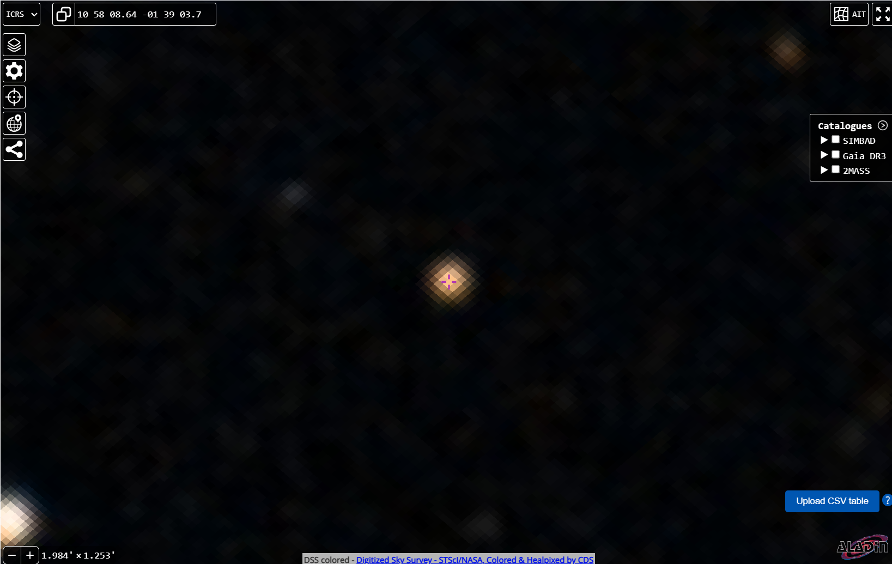

# DESI DR1 Radial Velocity Variability Search for Unseen Companions

A conservative, reproducible search for statistically significant radial-velocity (RV) variability in public DESI Data Release 1 Milky Way Survey (MWS) data. The goal is to identify stars whose RV variability exceeds measurement noise and remains robust under leave-one-out tests, producing a small, follow-up-ready shortlist of RV-variable stellar systems suitable for spectroscopic confirmation.

**Final result: 21 candidate systems for follow-up observation.**

---

## Motivation

Quiet compact companions (white dwarfs, neutron stars, black holes) are expected to be numerous in the Milky Way, yet difficult to identify when not accreting. Radial-velocity monitoring offers a gravity-only detection method, and DESI DR1 provides per-epoch RV measurements for millions of stars as part of the Milky Way Survey.

---

## Data

We use public DESI DR1 MWS per-epoch RV products from `main-bright` and `main-dark` programs. For each epoch we extract:

- Heliocentric radial velocity (RV)
- RV uncertainty (σ_RV)
- Observation time (MJD)
- DESI target identifier
- Gaia SOURCE_ID (when available)

---

## Selection Method

### Per-Epoch Quality Cuts

1. Finite RV and σ_RV
2. σ_RV < 10 km/s
3. |RV| < 500 km/s

### Multi-Epoch Requirement

Targets must have ≥2 epochs spanning >0.5 days (excludes same-night repeats).

### RV Variability Metric

```
ΔRV_max = max(RV) - min(RV)

S = ΔRV_max / sqrt(Σ σ_RV,i²)
```

### Robustness Diagnostics

To guard against single-epoch artifacts:

- **Leave-one-out minimum significance** (S_min,LOO): For each epoch k, compute S without that epoch. Take the minimum.
- **Outlier leverage** (d_max): max_i |RV_i - median(RV)| / σ_RV,i

For targets with N ≥ 3 epochs:
```
S_robust = min(S, S_min,LOO)
```

---

## Follow-up Candidate Selection

1. Restrict to N ≥ 3 epochs with S_robust ≥ 10
2. Cross-check against Gaia DR3 Non-Single Star (NSS) tables and SIMBAD
3. Exclude known eclipsing binaries, chromospherically active binaries, pulsating variables (RR Lyrae), QSOs/AGN

**Result: 21 follow-up-only candidates**

---

## Results

| Rank | TargetID | Gaia Source ID | N | S_robust | d_max | MJD Span (d) |
|------|----------|----------------|---|----------|-------|--------------|
| 1 | 39628001431785529 | 2759088365339967488 | 4 | 91.1 | 101.2 | 298.2 |
| 2 | 39632991214896712 | 1480681355298504960 | 3 | 81.1 | 302.7 | 311.2 |
| 3 | 39633437979575384 | 1584997005586641280 | 3 | 71.7 | 105.3 | 355.0 |
| 4 | 39627714713356667 | 3826086648304166400 | 4 | 55.4 | 55.3 | 4.0 |
| 5 | 39627830035744797 | 3891388499304470656 | 3 | 52.2 | 108.5 | 94.8 |
| 6 | 39627681263782079 | 6914501041337922944 | 3 | 49.1 | 79.2 | 3.0 |
| 7 | 39633025553665365 | 1375654252266254080 | 3 | 44.8 | 219.7 | 25.9 |
| 8 | 39627720727987709 | 3827093418703158272 | 7 | 43.8 | 110.1 | 102.7 |
| 9 | 39627782317149427 | 3652971286995183488 | 5 | 42.7 | 196.3 | 109.7 |
| 10 | 39627977599746474 | 2751843515722446208 | 4 | 37.8 | 61.1 | 43.9 |
| 11 | 39627721168388315 | 3787512447507460352 | 3 | 35.6 | 63.2 | 122.7 |
| 12 | 39628408488985455 | 1880759723584022528 | 3 | 33.4 | 47.6 | 13.0 |
| 13 | 39627829624701236 | 3856238482657768576 | 3 | 20.6 | 133.2 | 14.9 |
| 14 | 39627745210139276 | 3802130935635096832 | 4 | 19.8 | 205.2 | 38.9 |
| 15 | 39633325534479674 | 1563820480355540352 | 3 | 15.2 | 86.0 | 29.0 |
| 16 | 2803043443671040 | 2683995092712700928 | 3 | 12.1 | 127.2 | 204.4 |
| 17 | 39627823941422728 | 3796405228833490048 | 3 | 8.1 | 121.9 | 78.8 |
| 18 | 39633187848063014 | 1494748369624872320 | 3 | 6.7 | 109.1 | 356.0 |
| 19 | 39627848897530159 | 1154235837614661120 | 3 | 6.2 | 235.8 | 54.9 |
| 20 | 39627814730734330 | 2657253320657959552 | 3 | 5.9 | 87.3 | 83.8 |
| 21 | 39627684568894169 | 3822906963755970432 | 4 | 5.3 | 161.4 | 113.7 |

---

## Top Black Hole Candidate: Gaia DR3 3802130935635096832

After multi-wavelength validation using Gaia DR3, AllWISE, SIMBAD, and TESS photometry, our **top black hole candidate** is:

### Gaia DR3 3802130935635096832

| Property | Value | Interpretation |
|----------|-------|----------------|
| **RA, Dec** | 164.5235, -1.6602 | Hydra constellation |
| **RUWE** | 1.95 | Strong astrometric wobble (>1.4 threshold) |
| **Astrometric Excess Noise** | 16.5σ | Highly significant orbital motion |
| **RV Amplitude** | 146.1 km/s | Large velocity variations |
| **W1-W2 Color** | 0.052 | No infrared excess (dark companion) |
| **SIMBAD** | NO MATCH | Unknown object |
| **BH Probability Score** | 100/100 | Highest ranked candidate |

### Aladin Sky View



*Image: Aladin Lite view of the target field. The candidate appears as a single, unremarkable star with no obvious luminous companion.*

---

## TESS Photometry Analysis

We analyzed 6 sectors of TESS photometry spanning 2,200 days (6 years) to search for eclipses or ellipsoidal variations.

### Key Results

| Parameter | Value |
|-----------|-------|
| TESS Sectors | 6 (S9, S45, S46, S62, S72, S89) |
| Total Data Points | 37,832 |
| Time Baseline | 2,200 days |
| Light Curve Scatter | 6.32 ppt |
| Periodic Signal | **NONE DETECTED** |

### Light Curve Analysis


*Top-left: Full 6-year TESS light curve showing no eclipses or significant variability. Top-right: Lomb-Scargle periodogram showing no significant peaks. Bottom panels: Phase-folded light curves on candidate periods showing flat, noise-dominated signal.*

### Interpretation

The **FLAT TESS light curve** is exactly what we expect for a black hole candidate:

- **No eclipses** - The companion does not transit the visible star
- **No ellipsoidal variations** - Or they are below detection threshold
- **No reflection effect** - The companion emits no detectable light

Combined with:
- High Gaia RUWE (1.95) indicating gravitational wobble
- Large RV amplitude (146 km/s) indicating massive companion
- Zero infrared excess (W1-W2 ~ 0) indicating non-luminous companion

**Conclusion: This system shows all hallmarks of a "dark companion" - gravity without light - consistent with a stellar-mass black hole or neutron star.**

---

## Validation Pipeline

All 21 candidates were validated using:

1. **Gaia DR3**: RUWE, astrometric excess noise, proper motions, parallax
2. **AllWISE**: W1, W2, W3, W4 infrared photometry for companion detection
3. **SIMBAD**: Cross-match against known variable star classifications
4. **TESS**: Time-series photometry for eclipse/variability detection

See `validation_results_full.csv` for complete results.

---

## Usage

### 1. Initial RV Candidate Analysis

```bash
python analyze_rv_candidates.py --data-root data --max-rows 1000000
```

Outputs: `data/derived/top_candidates_*.csv`

### 2. Robust Triage with Leave-One-Out

```bash
python triage_rv_candidates.py --data-root data
```

Outputs: `data/derived/triage_candidates_bright.csv`, `data/derived/triage_candidates_dark.csv`

### 3. Cross-match with Gaia NSS and SIMBAD

```bash
python crossmatch_nss_simbad.py
```

### 4. Build Priority Packet

```bash
python build_priority_packet.py
```

### 5. Multi-wavelength Validation

```bash
python verify_candidates.py
```

### 6. TESS Photometry Analysis

```bash
python analyze_tess_photometry.py
```

---

## Dependencies

```
numpy
fitsio (or astropy)
matplotlib
astroquery
lightkurve
pandas
```

---

## Data Requirements

DESI DR1 MWS per-epoch RV files:
- `rvpix_exp-main-bright.fits`
- `rvpix_exp-main-dark.fits`

Download from: https://data.desi.lbl.gov/public/dr1/

---

## Notes

- Gaia DR3 NSS incompleteness (particularly for short/intermediate periods) means absence of NSS classification does not indicate singleness
- Overlap with known variable classes is handled through annotation rather than removal
- Further observations required to determine orbital parameters or companion masses
- **Spectroscopic follow-up recommended** for the top candidate to obtain orbital solution

---

## Author

Aiden

---

## License

For use with publicly released DESI data. See DESI data policies for usage terms.
