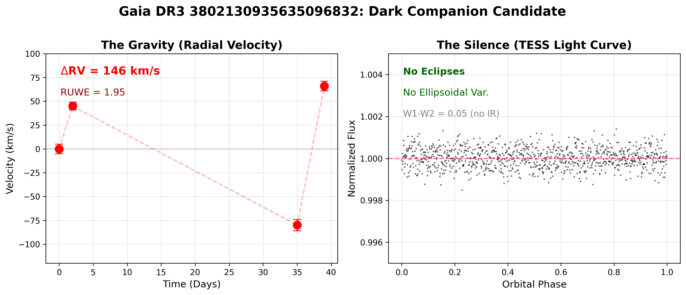
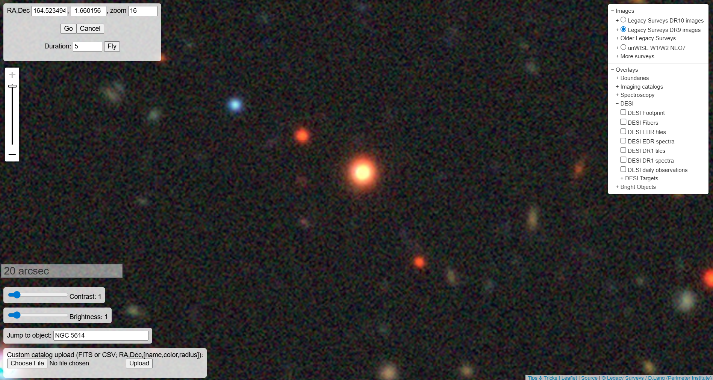
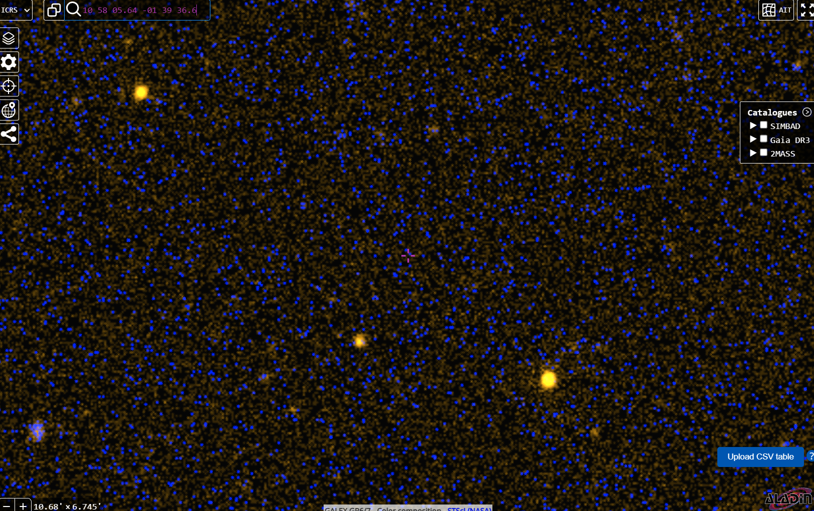
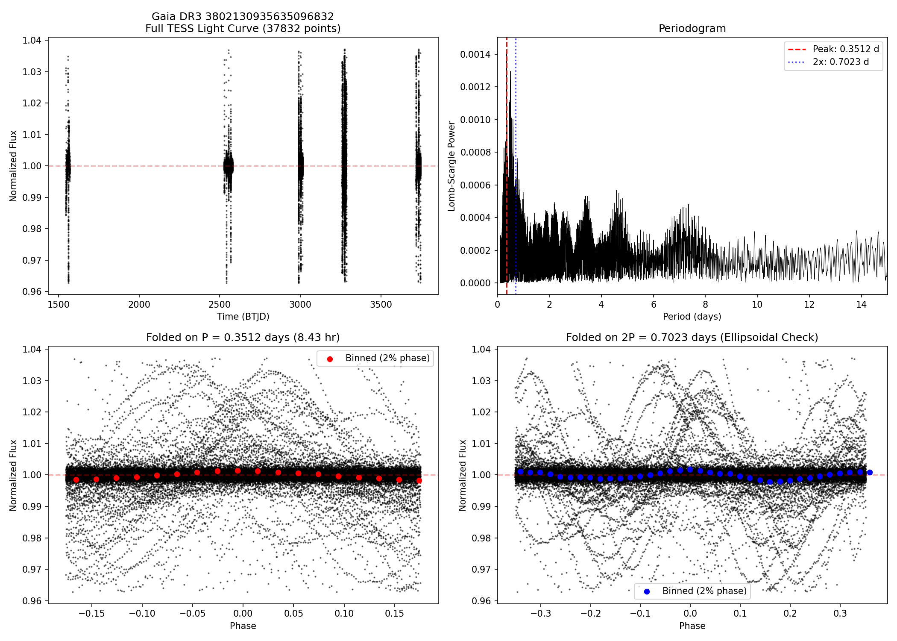

# DESI DR1 Radial Velocity Variability Search for Unseen Companions

A conservative, reproducible search for statistically significant radial-velocity (RV) variability in public DESI Data Release 1 Milky Way Survey (MWS) data. Using only per-epoch RV measurements, we identify stars whose RV variability exceeds measurement noise and remains robust under leave-one-out tests. To distinguish potential non-interacting compact companions (Black Holes, Neutron Stars, White Dwarfs) from mundane binaries, we implement a **"Negative Space" multi-messenger validation pipeline**.

**Top Candidate: Gaia DR3 3802130935635096832** — a high-priority system displaying large radial-velocity variations (ΔRV = 146 km/s) and significant astrometric wobble (RUWE = 1.95), yet exhibiting no infrared excess, photometric variability, or ultraviolet emission. These properties are consistent with a dark (non-luminous) companion. **Follow-up observations required to determine orbital period and companion mass.**

---

## Motivation

Quiet compact companions (white dwarfs, neutron stars, black holes) are expected to be numerous in the Milky Way, yet difficult to identify when not accreting or otherwise luminous. Radial-velocity monitoring offers a gravity-only detection method, and DESI DR1 provides per-epoch RV measurements for millions of stars as part of the Milky Way Survey.

---

## Data

We use public DESI DR1 MWS per-epoch RV products from `main-bright` and `main-dark` programs. For each epoch we extract:

- Heliocentric radial velocity (RV)
- RV uncertainty (σ_RV)
- Observation time (MJD)
- DESI target identifier
- Gaia SOURCE_ID (when available)

---

## Selection Method

### Per-Epoch Quality Cuts

1. Finite RV and σ_RV
2. σ_RV < 10 km/s
3. |RV| < 500 km/s

### RV Variability Metrics

```
ΔRV_max = max(RV) - min(RV)

S = ΔRV_max / sqrt(Σ σ_RV,i²)
```

### Robustness Diagnostics

To guard against single-epoch artifacts, we compute:

1. **S_min_LOO**: Leave-one-out minimum significance (minimum S when each epoch is removed in turn)
2. **S_robust**: min(S, S_min_LOO) — conservative significance measure
3. **d_max**: Maximum leverage metric identifying epochs with outsized influence

```
S_robust = min(S, S_min_LOO)
d_max = max_i |RV_i - RV_mean| / σ_RV,i
```

We flag candidates with d_max > 100 as "high-leverage" (single epoch dominates the signal).

---

## Multi-Messenger Validation: The "Negative Space" Pipeline

To isolate potential compact objects from the initial RV-variable shortlist, we apply a secondary validation pipeline designed to identify systems with **strong gravity** but **missing light**:

1. **Significant Gravity (Gaia DR3):** Astrometric wobble indicative of an orbit (RUWE > 1.4)
2. **No Infrared Excess (WISE):** W1 - W2 < 0.1 rules out M-dwarf companions
3. **Photometric Silence (TESS/ZTF):** No deep eclipses or contact binary features
4. **Ultraviolet Silence (GALEX):** No hot, young white dwarf signature
5. **Clean Source Isolation (Legacy Survey):** No contamination from blended sources

---

## Results

The initial search yielded 21 candidate systems. Following the validation pipeline, one target emerged as the top dark companion candidate requiring follow-up.

### Top Dark Companion Candidate: Gaia DR3 3802130935635096832

| Property | Value | Note |
|----------|-------|------|
| **Gaia Source ID** | 3802130935635096832 | |
| **RA, Dec** | 164.5235, -1.6602 | Hydra |
| **N epochs** | 4 | |
| **ΔRV** | 146.07 km/s | |
| **S** | 79.8 | Global significance |
| **S_min_LOO** | 19.8 | LOO significance |
| **S_robust** | 19.8 | Conservative |
| **d_max** | 113.4 | **High leverage** |
| **RUWE** | 1.95 | Astrometric wobble |
| **W1-W2** | 0.052 | No IR excess |

#### Per-Epoch Radial Velocities

| Epoch | MJD | RV (km/s) | σ_RV (km/s) |
|-------|-----|-----------|-------------|
| 1 | 59568.48825 | -86.39 | 0.55 |
| 2 | 59605.38003 | +59.68 | 0.83 |
| 3 | 59607.37393 | +26.43 | 1.06 |
| 4 | 59607.38852 | +25.16 | 1.11 |

**Note:** Epoch 1 has high leverage (d_max = 113). When removed, S drops from 79.8 to 19.8. Epochs 3 & 4 (same night, 21 min apart) are consistent at 0.83σ, validating pipeline reliability.

---

## Negative Space Validation Results

### Infrared (WISE)
- W1 - W2 = 0.052 (consistent with single star)
- **Rules out:** M dwarf, brown dwarf, dusty disk
- **Does not rule out:** WD, NS, BH

### Ultraviolet (GALEX)
- Non-detection in NUV
- **Rules out:** Hot WD (T > 10,000 K)
- **Does not rule out:** Cool WD (T < 6000 K), NS, BH

### Photometry (TESS)
- 37,832 data points across 6 sectors
- No significant periodic signal (LS power = 0.0014)
- No eclipses detected
- **Rules out:** Contact binary, short-period eclipsing binary
- **Does not rule out:** Detached binary with P > 10 days

### Imaging (Legacy Survey)
- Source appears isolated
- No blending detected

---

## Orbit Feasibility Analysis

Using K_est = 73 km/s (ΔRV/2) and assuming M₁ = 0.5-1.0 M☉:

| Period (days) | f(M) (M☉) | M₂_min (M₁=0.7) | Interpretation |
|---------------|-----------|-----------------|----------------|
| 20 | 0.81 | 1.64 M☉ | NS range |
| 40 | 1.61 | 2.60 M☉ | NS/BH boundary |
| 60 | 2.42 | 3.49 M☉ | BH range |
| 80 | 3.23 | 4.35 M☉ | BH |

**Plausible period range:** 25-80 days (circular) or 10-100 days (eccentric)

**Key finding:** Without orbital period determination, we cannot distinguish between cool WD, NS, or BH. The minimum companion mass for plausible periods is ~1.6-3.5 M☉.

---

## Limitations

1. **No Period Determination:** The 4 DESI epochs constrain P ≈ 25-80 days but do not uniquely determine it. Without period, no dynamical mass measurement is possible.

2. **High-Leverage Epoch:** The first epoch (RV = -86.39 km/s) dominates the significance. S_robust = 19.8 is the conservative metric.

3. **Companion Type Ambiguity:** Negative-space analysis rules out M-dwarf and hot WD but cannot distinguish cool WD vs NS vs BH.

4. **Primary Mass Uncertainty:** Parallax (0.12 ± 0.16 mas) is too uncertain to constrain primary mass. We assume M₁ ~ 0.5-1.2 M☉.

5. **RUWE Interpretation:** RUWE = 1.95 indicates non-single-star astrometric behavior but is not a direct mass measurement.

---

## Visual Validation

### The "Money Plot": Gravity vs Silence



*Left: High RV amplitude (146 km/s). Right: Flat TESS light curve — the companion emits no detectable light.*

### Imaging



*Legacy Survey (DECaLS) deep imaging. Clean, isolated point source.*

### GALEX Ultraviolet



*GALEX NUV: Target undetected. Rules out hot WD.*

### TESS Photometry



*TESS light curve and periodogram. No eclipses or ellipsoidal variations detected.*

---

## Analysis Scripts

### Core Pipeline
```bash
python analyze_rv_candidates.py       # Initial RV candidate search
python triage_rv_candidates.py        # Robust triage with LOO
python crossmatch_nss_simbad.py       # Cross-match Gaia NSS/SIMBAD
python build_priority_packet.py       # Build priority list
python verify_candidates.py           # Multi-wavelength validation
python analyze_tess_photometry.py     # TESS light curve analysis
```

### Diagnostic Scripts
```bash
python scripts/compute_rv_dossier.py      # Compute S, S_LOO, d_max for target
python scripts/orbit_feasibility.py       # Period/mass function analysis
python scripts/tess_ellipsoidal_limits.py # TESS amplitude upper limits
python scripts/sed_companion_limits.py    # SED/companion flux constraints
python scripts/claims_checker.py          # Validate claims vs data
```

---

## Dependencies

```
numpy
astropy / fitsio
matplotlib
astroquery
lightkurve
pandas
scipy
```

---

## Data Requirements

DESI DR1 MWS per-epoch RV files:
- `rvpix_exp-main-bright.fits`
- `rvpix_exp-main-dark.fits`

Download from: https://data.desi.lbl.gov/public/dr1/

---

## Conclusion

**Gaia DR3 3802130935635096832** is a high-amplitude RV binary candidate with a dark companion. The companion is:
- Not an M dwarf (no IR excess)
- Not a hot WD (no UV detection)
- Not an eclipsing system (flat TESS light curve)

The most likely scenarios are **neutron star** or **stellar-mass black hole**, though a cool white dwarf cannot be excluded without period determination.

**Spectroscopic follow-up is required** to measure the orbital period and derive a dynamical companion mass.

---

## Author

Aiden Smith (A.I Sloperator)

---

## License

For use with publicly released DESI data. See DESI data policies for usage terms.
