# E1_mass_gap MCMC Verification Report

Generated: 2026-01-15T19:09:03.451002

Total candidates analyzed: 30/30

## Summary Table

| Rank | TargetID | N_epochs | ΔRV | P_mcmc | K_mcmc | M2_min | Pr(NS+) | Pr(BH) | Status |
|------|----------|----------|-----|--------|--------|--------|---------|--------|--------|
| 1 | 39627872045893843 | 5 | 422.7 | 17.1 | 234.9 | 25.68 | 100% | 100% | **BH CANDIDATE** |
| 2 | 39627805893329991 | 5 | 412.2 | 8.7 | 231.7 | 10.73 | 100% | 96% | **BH CANDIDATE** |
| 3 | 39627781323096335 | 6 | 227.1 | 23.0 | 235.0 | 26.79 | 100% | 100% | **BH CANDIDATE** |
| 4 | 39627775400742282 | 6 | 231.6 | 11.6 | 152.3 | 5.20 | 82% | 61% | **BH CANDIDATE** |
| 5 | 39627660803968944 | 9 | 180.5 | 95.1 | 75.8 | 5.48 | 100% | 95% | **BH CANDIDATE** |
| 6 | 39627697734815982 | 7 | 223.2 | 10.1 | 112.3 | 2.34 | 99% | 32% | NS candidate |
| 7 | 39627634937694383 | 5 | 120.1 | 11.4 | 96.3 | 2.38 | 100% | 23% | NS candidate |
| 8 | 39627672464130135 | 7 | 155.0 | 1.5 | 167.0 | 1.32 | 46% | 18% | Review needed |
| 9 | 39627580969583320 | 5 | 298.4 | 16.1 | 154.6 | 7.08 | 100% | 82% | **BH CANDIDATE** |
| 10 | 39627624485487722 | 7 | 58.7 | 36.8 | 99.8 | 5.49 | 97% | 80% | **BH CANDIDATE** |
| 11 | 39627860964543690 | 4 | 237.7 | 1.1 | 261.0 | 3.03 | 86% | 50% | **BH CANDIDATE** |
| 12 | 39627697768369126 | 4 | 420.9 | 1.1 | 262.5 | 3.58 | 100% | 67% | **BH CANDIDATE** |
| 13 | 39632971258400629 | 4 | 429.5 | 96.5 | 278.6 | 92.13 | 100% | 100% | **BH CANDIDATE** |
| 14 | 39632994691977319 | 7 | 124.9 | 31.9 | 70.3 | 2.28 | 81% | 37% | NS candidate |
| 15 | 39627775883085095 | 5 | 82.3 | 2.3 | 218.1 | 3.56 | 95% | 60% | **BH CANDIDATE** |
| 16 | 39627569259091193 | 4 | 437.9 | 39.8 | 286.8 | 65.49 | 100% | 100% | **BH CANDIDATE** |
| 17 | 39627697256661738 | 5 | 144.1 | 10.4 | 258.0 | 24.64 | 100% | 100% | **BH CANDIDATE** |
| 18 | 39627867411190557 | 4 | 362.8 | 1.3 | 292.1 | 4.20 | 96% | 71% | **BH CANDIDATE** |
| 19 | 39632936437288261 | 4 | 213.6 | 0.9 | 232.5 | 2.91 | 94% | 43% | NS candidate |
| 20 | 39632986462751504 | 4 | 205.5 | 26.3 | 247.4 | 25.16 | 98% | 98% | **BH CANDIDATE** |
| 21 | 39627691615322556 | 4 | 239.2 | 6.4 | 169.3 | 5.19 | 100% | 77% | **BH CANDIDATE** |
| 22 | 39627594278113473 | 4 | 332.6 | 8.6 | 198.0 | 6.01 | 93% | 81% | **BH CANDIDATE** |
| 23 | 39632940988106485 | 4 | 315.1 | 5.8 | 190.0 | 5.64 | 100% | 89% | **BH CANDIDATE** |
| 24 | 39627920607545906 | 4 | 380.0 | 17.7 | 216.3 | 16.53 | 100% | 100% | **BH CANDIDATE** |
| 25 | 39627921429627193 | 4 | 257.8 | 34.8 | 151.7 | 11.98 | 94% | 90% | **BH CANDIDATE** |
| 26 | 39627691564992866 | 7 | 40.0 | 107.5 | 62.2 | 3.98 | 72% | 57% | **BH CANDIDATE** |
| 27 | 39627793683711308 | 6 | 50.5 | 59.4 | 39.1 | 0.90 | 43% | 24% | Review needed |
| 28 | 39627860838712972 | 5 | 48.5 | 34.5 | 77.5 | 3.06 | 94% | 55% | **BH CANDIDATE** |
| 29 | 39627800969222315 | 4 | 66.5 | 40.7 | 66.9 | 2.49 | 89% | 43% | NS candidate |
| 30 | 39627745210139276 | 4 | 146.1 | 10.2 | 107.2 | 1.58 | 59% | 25% | NS candidate |

## Top Candidates (Pr(BH) > 30%)

### Target 39627660803968944

- **MCMC Period**: 95.07 days (68% CI: 89.79 - 174.06)
- **MCMC K**: 75.8 km/s (68% CI: 64.2 - 121.2)
- **Eccentricity**: 0.424
- **M2_min**: 5.48 M☉ (68% CI: 3.78 - 16.70)
- **Pr(M2 > 1.4 M☉)**: 100.0%
- **Pr(M2 > 3.0 M☉)**: 94.9%

Fast-screen comparison: P=91.5d, K=69.6km/s

### Target 39627921429627193

- **MCMC Period**: 34.84 days (68% CI: 23.44 - 48.96)
- **MCMC K**: 151.7 km/s (68% CI: 113.7 - 192.2)
- **Eccentricity**: 0.297
- **M2_min**: 11.98 M☉ (68% CI: 5.42 - 31.82)
- **Pr(M2 > 1.4 M☉)**: 94.5%
- **Pr(M2 > 3.0 M☉)**: 89.9%

Fast-screen comparison: P=25.1d, K=144.3km/s

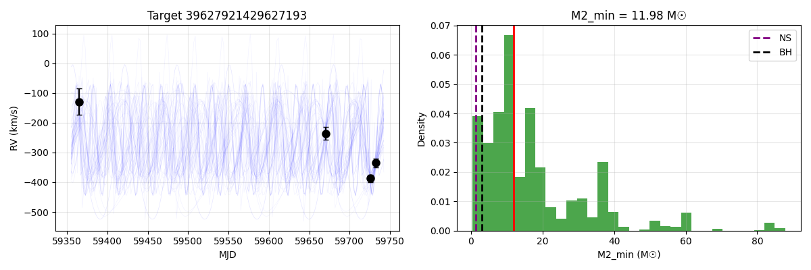

### Target 39632940988106485

- **MCMC Period**: 5.76 days (68% CI: 4.90 - 6.10)
- **MCMC K**: 190.0 km/s (68% CI: 164.8 - 272.1)
- **Eccentricity**: 0.302
- **M2_min**: 5.64 M☉ (68% CI: 3.20 - 11.42)
- **Pr(M2 > 1.4 M☉)**: 100.0%
- **Pr(M2 > 3.0 M☉)**: 88.6%

Fast-screen comparison: P=4.2d, K=271.0km/s

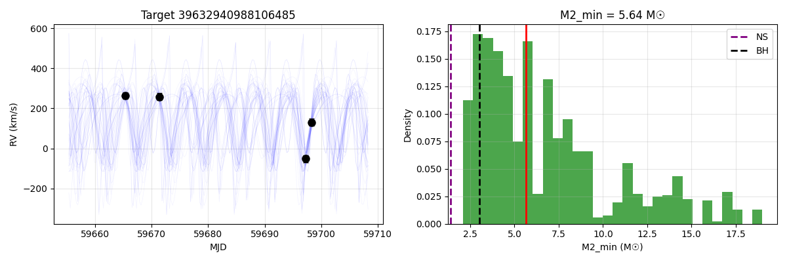

### Target 39627580969583320

- **MCMC Period**: 16.09 days (68% CI: 14.17 - 27.45)
- **MCMC K**: 154.6 km/s (68% CI: 108.1 - 209.4)
- **Eccentricity**: 0.275
- **M2_min**: 7.08 M☉ (68% CI: 2.93 - 22.60)
- **Pr(M2 > 1.4 M☉)**: 99.9%
- **Pr(M2 > 3.0 M☉)**: 81.6%

Fast-screen comparison: P=16.4d, K=160.6km/s

### Target 39627594278113473

- **MCMC Period**: 8.64 days (68% CI: 1.64 - 14.36)
- **MCMC K**: 198.0 km/s (68% CI: 146.1 - 252.5)
- **Eccentricity**: 0.214
- **M2_min**: 6.01 M☉ (68% CI: 2.39 - 19.61)
- **Pr(M2 > 1.4 M☉)**: 93.1%
- **Pr(M2 > 3.0 M☉)**: 81.0%

Fast-screen comparison: P=7.0d, K=250.3km/s

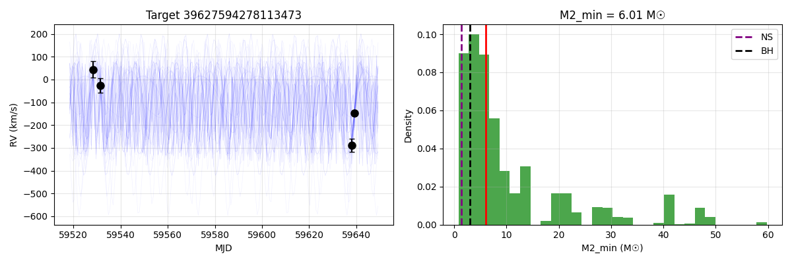

### Target 39627624485487722

- **MCMC Period**: 36.79 days (68% CI: 32.53 - 54.44)
- **MCMC K**: 99.8 km/s (68% CI: 68.5 - 137.9)
- **Eccentricity**: 0.180
- **M2_min**: 5.49 M☉ (68% CI: 2.90 - 13.13)
- **Pr(M2 > 1.4 M☉)**: 97.2%
- **Pr(M2 > 3.0 M☉)**: 80.3%

Fast-screen comparison: P=32.5d, K=128.2km/s

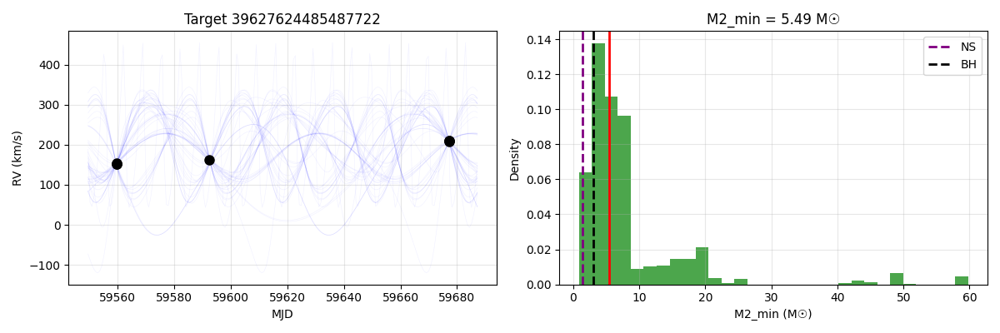

### Target 39627691615322556

- **MCMC Period**: 6.39 days (68% CI: 2.90 - 9.34)
- **MCMC K**: 169.3 km/s (68% CI: 115.0 - 257.2)
- **Eccentricity**: 0.269
- **M2_min**: 5.19 M☉ (68% CI: 2.71 - 11.41)
- **Pr(M2 > 1.4 M☉)**: 100.0%
- **Pr(M2 > 3.0 M☉)**: 76.7%

Fast-screen comparison: P=5.4d, K=266.9km/s

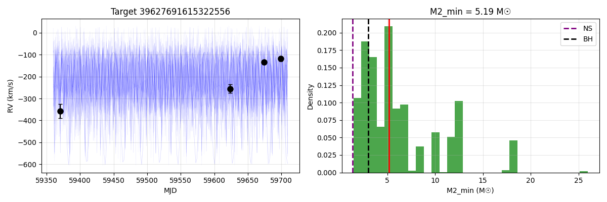

### Target 39627775400742282

- **MCMC Period**: 11.63 days (68% CI: 2.51 - 23.70)
- **MCMC K**: 152.3 km/s (68% CI: 110.0 - 219.4)
- **Eccentricity**: 0.321
- **M2_min**: 5.20 M☉ (68% CI: 1.27 - 25.53)
- **Pr(M2 > 1.4 M☉)**: 81.8%
- **Pr(M2 > 3.0 M☉)**: 60.9%

Fast-screen comparison: P=10.4d, K=164.5km/s

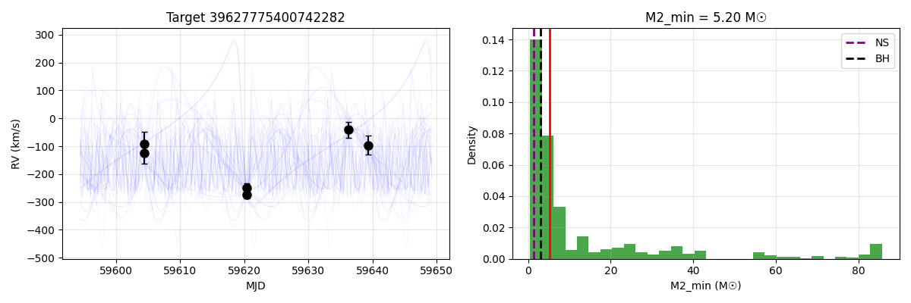

### Target 39627691564992866

- **MCMC Period**: 107.54 days (68% CI: 76.81 - 160.02)
- **MCMC K**: 62.2 km/s (68% CI: 27.7 - 105.4)
- **Eccentricity**: 0.445
- **M2_min**: 3.98 M☉ (68% CI: 1.01 - 13.33)
- **Pr(M2 > 1.4 M☉)**: 72.2%
- **Pr(M2 > 3.0 M☉)**: 56.8%

Fast-screen comparison: P=106.5d, K=101.6km/s

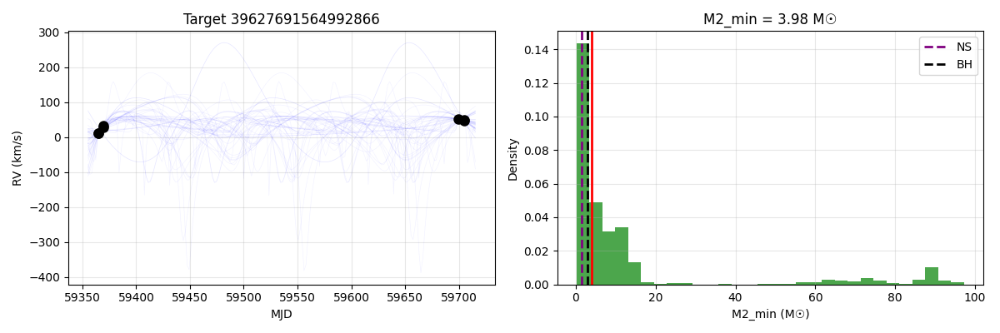

### Target 39627860838712972

- **MCMC Period**: 34.53 days (68% CI: 24.32 - 49.43)
- **MCMC K**: 77.5 km/s (68% CI: 54.1 - 115.3)
- **Eccentricity**: 0.354
- **M2_min**: 3.06 M☉ (68% CI: 1.65 - 6.90)
- **Pr(M2 > 1.4 M☉)**: 94.4%
- **Pr(M2 > 3.0 M☉)**: 54.8%

Fast-screen comparison: P=25.8d, K=111.8km/s

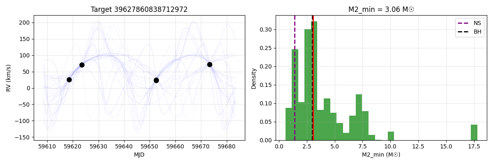

### Target 39627800969222315

- **MCMC Period**: 40.74 days (68% CI: 20.56 - 41.87)
- **MCMC K**: 66.9 km/s (68% CI: 57.1 - 96.4)
- **Eccentricity**: 0.236
- **M2_min**: 2.49 M☉ (68% CI: 1.56 - 5.51)
- **Pr(M2 > 1.4 M☉)**: 89.1%
- **Pr(M2 > 3.0 M☉)**: 42.5%

Fast-screen comparison: P=28.7d, K=83.2km/s

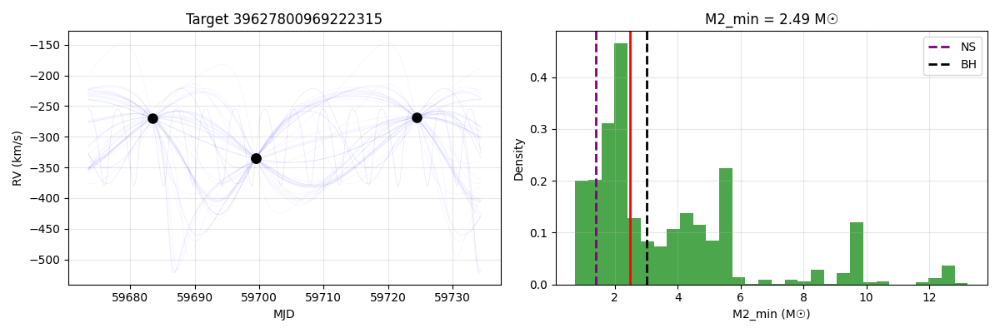

### Target 39632994691977319

- **MCMC Period**: 31.86 days (68% CI: 29.83 - 81.12)
- **MCMC K**: 70.3 km/s (68% CI: 55.3 - 130.6)
- **Eccentricity**: 0.396
- **M2_min**: 2.28 M☉ (68% CI: 1.31 - 14.17)
- **Pr(M2 > 1.4 M☉)**: 81.0%
- **Pr(M2 > 3.0 M☉)**: 36.7%

Fast-screen comparison: P=30.1d, K=96.0km/s

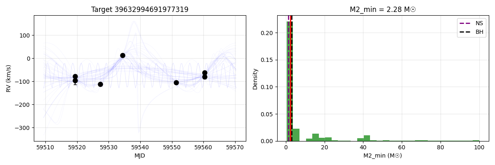

### Target 39627697734815982

- **MCMC Period**: 10.12 days (68% CI: 7.17 - 16.80)
- **MCMC K**: 112.3 km/s (68% CI: 88.7 - 139.6)
- **Eccentricity**: 0.261
- **M2_min**: 2.34 M☉ (68% CI: 1.76 - 6.10)
- **Pr(M2 > 1.4 M☉)**: 98.8%
- **Pr(M2 > 3.0 M☉)**: 32.0%

Fast-screen comparison: P=10.2d, K=134.7km/s

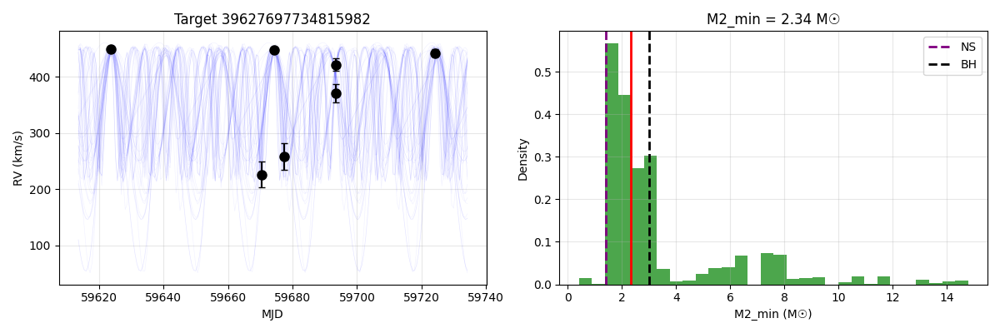

## Suspicious Candidates (K > 200 km/s)

These candidates have very high K values that may indicate period aliasing or systematic issues.

- **39627872045893843**: K=235 km/s, P=17.1d - needs verification
- **39627805893329991**: K=232 km/s, P=8.7d - needs verification
- **39627781323096335**: K=235 km/s, P=23.0d - needs verification
- **39627860964543690**: K=261 km/s, P=1.1d - needs verification
- **39627697768369126**: K=262 km/s, P=1.1d - needs verification

## Statistics

- Candidates with K < 100 km/s: 8
- Candidates with K 100-200 km/s: 9
- Candidates with K > 200 km/s: 13

- Candidates with M2_min > 3 M☉: 22
- Candidates with M2_min 1.4-3 M☉: 6
- Candidates with M2_min < 1.4 M☉: 2

---
*Report generated by mcmc_e1_detailed.py*