# E2_dark_companions MCMC Verification Report

Generated: 2026-01-15T19:24:32.001043

Total candidates analyzed: 30/30

## Summary Table

| Rank | TargetID | N_epochs | ΔRV | P_mcmc | K_mcmc | M2_min | Pr(NS+) | Pr(BH) | Status |
|------|----------|----------|-----|--------|--------|--------|---------|--------|--------|
| 1 | 39627781323096335 | 6 | 227.1 | 23.9 | 238.5 | 34.48 | 100% | 100% | **BH CANDIDATE** |
| 2 | 39627775400742282 | 6 | 231.6 | 11.7 | 132.4 | 5.14 | 89% | 78% | **BH CANDIDATE** |
| 3 | 39627660803968944 | 9 | 180.5 | 93.4 | 69.1 | 4.87 | 100% | 96% | **BH CANDIDATE** |
| 4 | 39627697734815982 | 7 | 223.2 | 8.5 | 122.9 | 2.99 | 92% | 50% | NS candidate |
| 5 | 39627672464130135 | 7 | 155.0 | 1.3 | 180.0 | 1.42 | 51% | 9% | NS candidate |
| 6 | 39627580969583320 | 5 | 298.4 | 19.7 | 127.4 | 5.45 | 97% | 77% | **BH CANDIDATE** |
| 7 | 39627634937694383 | 5 | 120.1 | 10.2 | 116.0 | 2.96 | 93% | 47% | NS candidate |
| 8 | 39627786842800776 | 5 | 219.5 | 21.9 | 163.0 | 8.24 | 93% | 76% | **BH CANDIDATE** |
| 9 | 39627872045893843 | 5 | 422.7 | 14.7 | 245.8 | 29.41 | 100% | 100% | **BH CANDIDATE** |
| 10 | 39627933777661858 | 5 | 264.0 | 3.6 | 279.9 | 8.95 | 94% | 81% | **BH CANDIDATE** |
| 11 | 39632996227090858 | 5 | 247.4 | 27.3 | 145.3 | 12.61 | 100% | 100% | **BH CANDIDATE** |
| 12 | 39632935875250494 | 5 | 487.7 | 7.9 | 320.0 | 44.05 | 100% | 100% | **BH CANDIDATE** |
| 13 | 39627805893329991 | 5 | 412.2 | 9.3 | 265.4 | 20.37 | 96% | 96% | **BH CANDIDATE** |
| 14 | 39627624485487722 | 7 | 58.7 | 33.5 | 89.3 | 4.04 | 95% | 77% | **BH CANDIDATE** |
| 15 | 39632994691977319 | 7 | 124.9 | 30.7 | 68.6 | 2.22 | 84% | 30% | NS candidate |
| 16 | 39627775883085095 | 5 | 82.3 | 1.6 | 242.0 | 3.85 | 100% | 75% | **BH CANDIDATE** |
| 17 | 39627697256661738 | 5 | 144.1 | 23.3 | 246.4 | 38.90 | 100% | 100% | **BH CANDIDATE** |
| 18 | 39628527955347936 | 4 | 681.1 | 227.7 | 449.2 | nan | 0% | 0% | High-K (suspect) |
| 19 | 39627842408943267 | 4 | 258.7 | 72.7 | 157.5 | 35.43 | 100% | 100% | **BH CANDIDATE** |
| 20 | 39627867411190557 | 4 | 362.8 | 1.3 | 250.9 | 3.46 | 96% | 64% | **BH CANDIDATE** |
| 21 | 39627921429627193 | 4 | 257.8 | 34.9 | 132.8 | 7.43 | 97% | 90% | **BH CANDIDATE** |
| 22 | 39627569259091193 | 4 | 437.9 | 49.3 | 290.1 | 77.57 | 100% | 100% | **BH CANDIDATE** |
| 23 | 39632936437288261 | 4 | 213.6 | 1.1 | 257.1 | 3.46 | 100% | 79% | **BH CANDIDATE** |
| 24 | 39627920607545906 | 4 | 380.0 | 12.8 | 246.0 | 22.00 | 100% | 100% | **BH CANDIDATE** |
| 25 | 39627860964543690 | 4 | 237.7 | 1.8 | 250.3 | 3.25 | 96% | 52% | **BH CANDIDATE** |
| 26 | 39627691502079881 | 4 | 500.2 | 22.1 | 257.5 | 31.68 | 100% | 100% | **BH CANDIDATE** |
| 27 | 39627697768369126 | 4 | 420.9 | 1.2 | 267.1 | 4.01 | 100% | 73% | **BH CANDIDATE** |
| 28 | 39632986462751504 | 4 | 205.5 | 27.3 | 226.3 | 43.34 | 100% | 100% | **BH CANDIDATE** |
| 29 | 39632971258400629 | 4 | 429.5 | 93.0 | 253.7 | 80.14 | 100% | 100% | **BH CANDIDATE** |
| 30 | 39632940988106485 | 4 | 315.1 | 4.8 | 196.6 | 4.93 | 96% | 73% | **BH CANDIDATE** |

## Top Candidates (Pr(BH) > 30%)

### Target 39632996227090858

- **MCMC Period**: 27.31 days (68% CI: 16.12 - 37.55)
- **MCMC K**: 145.3 km/s (68% CI: 117.5 - 198.0)
- **Eccentricity**: 0.307
- **M2_min**: 12.61 M☉ (68% CI: 4.20 - 25.25)
- **Pr(M2 > 1.4 M☉)**: 100.0%
- **Pr(M2 > 3.0 M☉)**: 100.0%

Fast-screen comparison: P=22.2d, K=200.2km/s

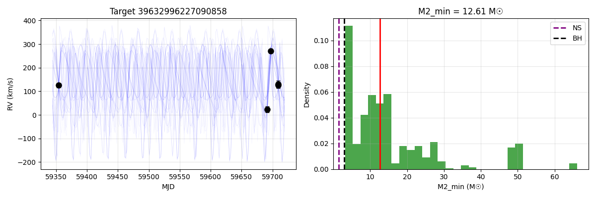

### Target 39627842408943267

- **MCMC Period**: 72.70 days (68% CI: 48.07 - 100.74)
- **MCMC K**: 157.5 km/s (68% CI: 131.1 - 213.5)
- **Eccentricity**: 0.228
- **M2_min**: 35.43 M☉ (68% CI: 14.83 - 64.75)
- **Pr(M2 > 1.4 M☉)**: 100.0%
- **Pr(M2 > 3.0 M☉)**: 100.0%

Fast-screen comparison: P=57.1d, K=172.9km/s

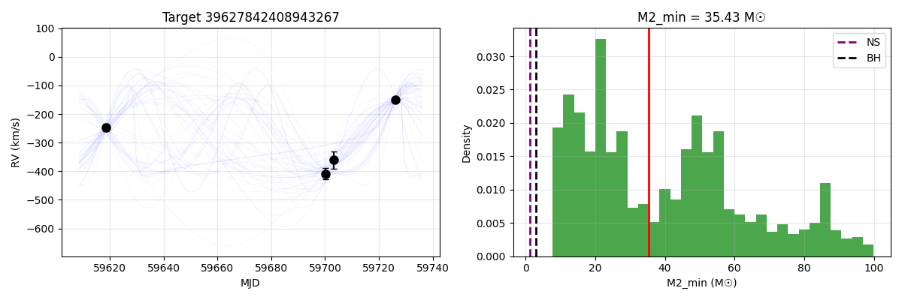

### Target 39627660803968944

- **MCMC Period**: 93.42 days (68% CI: 89.83 - 216.05)
- **MCMC K**: 69.1 km/s (68% CI: 61.1 - 78.7)
- **Eccentricity**: 0.300
- **M2_min**: 4.87 M☉ (68% CI: 3.62 - 9.16)
- **Pr(M2 > 1.4 M☉)**: 100.0%
- **Pr(M2 > 3.0 M☉)**: 95.8%

Fast-screen comparison: P=91.5d, K=69.6km/s

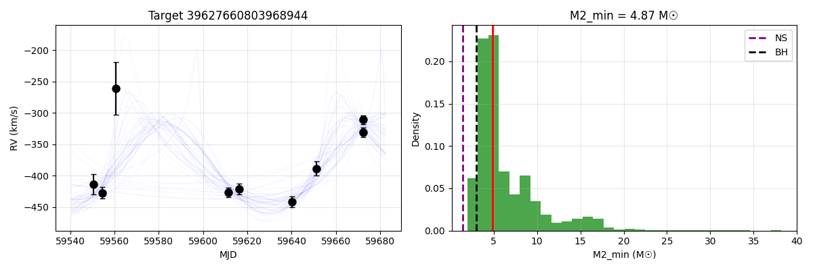

### Target 39627921429627193

- **MCMC Period**: 34.87 days (68% CI: 24.74 - 43.33)
- **MCMC K**: 132.8 km/s (68% CI: 106.7 - 169.2)
- **Eccentricity**: 0.237
- **M2_min**: 7.43 M☉ (68% CI: 4.42 - 20.07)
- **Pr(M2 > 1.4 M☉)**: 97.4%
- **Pr(M2 > 3.0 M☉)**: 90.4%

Fast-screen comparison: P=25.1d, K=144.3km/s

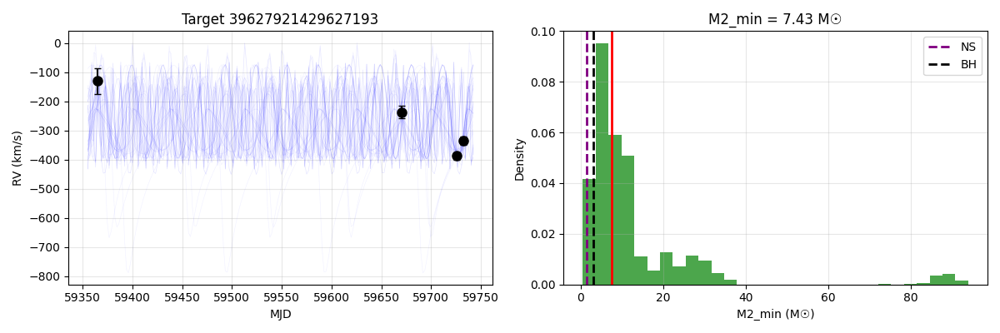

### Target 39627775400742282

- **MCMC Period**: 11.68 days (68% CI: 3.60 - 29.70)
- **MCMC K**: 132.4 km/s (68% CI: 104.6 - 199.0)
- **Eccentricity**: 0.259
- **M2_min**: 5.14 M☉ (68% CI: 2.42 - 10.13)
- **Pr(M2 > 1.4 M☉)**: 89.0%
- **Pr(M2 > 3.0 M☉)**: 78.3%

Fast-screen comparison: P=10.4d, K=164.5km/s

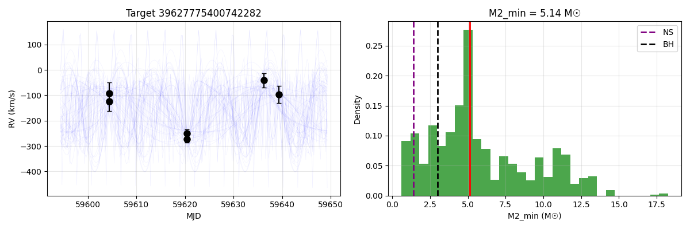

### Target 39627624485487722

- **MCMC Period**: 33.49 days (68% CI: 24.29 - 56.15)
- **MCMC K**: 89.3 km/s (68% CI: 74.3 - 118.8)
- **Eccentricity**: 0.362
- **M2_min**: 4.04 M☉ (68% CI: 2.67 - 7.43)
- **Pr(M2 > 1.4 M☉)**: 95.4%
- **Pr(M2 > 3.0 M☉)**: 77.2%

Fast-screen comparison: P=32.5d, K=128.2km/s

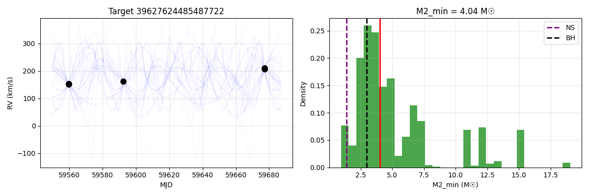

### Target 39627580969583320

- **MCMC Period**: 19.71 days (68% CI: 14.33 - 32.41)
- **MCMC K**: 127.4 km/s (68% CI: 77.5 - 189.7)
- **Eccentricity**: 0.331
- **M2_min**: 5.45 M☉ (68% CI: 2.50 - 14.43)
- **Pr(M2 > 1.4 M☉)**: 97.2%
- **Pr(M2 > 3.0 M☉)**: 76.7%

Fast-screen comparison: P=16.4d, K=160.6km/s

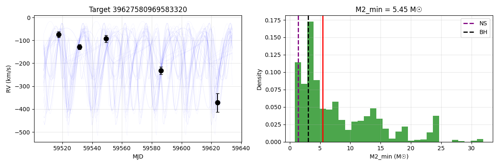

### Target 39627786842800776

- **MCMC Period**: 21.93 days (68% CI: 11.46 - 30.16)
- **MCMC K**: 163.0 km/s (68% CI: 90.7 - 188.9)
- **Eccentricity**: 0.322
- **M2_min**: 8.24 M☉ (68% CI: 2.61 - 18.27)
- **Pr(M2 > 1.4 M☉)**: 93.2%
- **Pr(M2 > 3.0 M☉)**: 76.4%

Fast-screen comparison: P=14.9d, K=245.8km/s

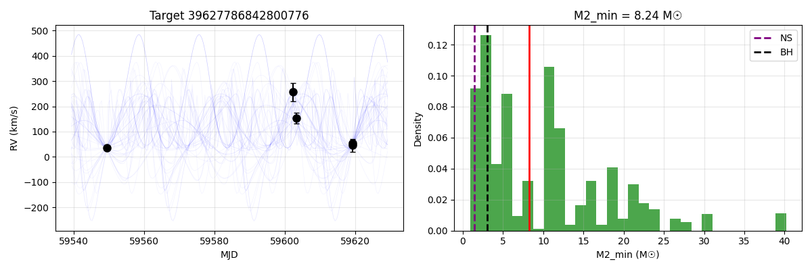

### Target 39632940988106485

- **MCMC Period**: 4.85 days (68% CI: 3.06 - 6.06)
- **MCMC K**: 196.6 km/s (68% CI: 159.9 - 263.8)
- **Eccentricity**: 0.295
- **M2_min**: 4.93 M☉ (68% CI: 2.35 - 7.95)
- **Pr(M2 > 1.4 M☉)**: 95.9%
- **Pr(M2 > 3.0 M☉)**: 72.6%

Fast-screen comparison: P=4.2d, K=271.0km/s

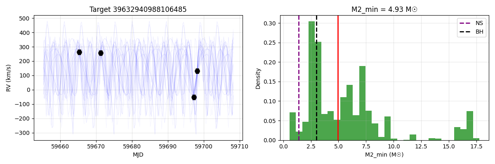

### Target 39627697734815982

- **MCMC Period**: 8.45 days (68% CI: 7.13 - 16.23)
- **MCMC K**: 122.9 km/s (68% CI: 94.9 - 155.6)
- **Eccentricity**: 0.372
- **M2_min**: 2.99 M☉ (68% CI: 1.79 - 5.06)
- **Pr(M2 > 1.4 M☉)**: 91.8%
- **Pr(M2 > 3.0 M☉)**: 49.9%

Fast-screen comparison: P=10.2d, K=134.7km/s

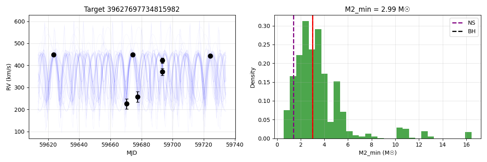

### Target 39627634937694383

- **MCMC Period**: 10.20 days (68% CI: 4.42 - 13.24)
- **MCMC K**: 116.0 km/s (68% CI: 89.8 - 146.4)
- **Eccentricity**: 0.319
- **M2_min**: 2.96 M☉ (68% CI: 1.81 - 4.87)
- **Pr(M2 > 1.4 M☉)**: 93.4%
- **Pr(M2 > 3.0 M☉)**: 46.9%

Fast-screen comparison: P=9.0d, K=124.0km/s

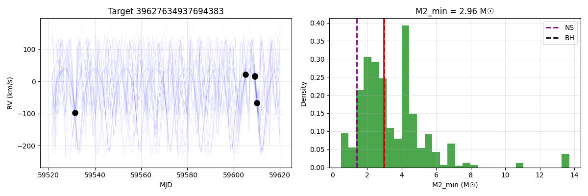

## Suspicious Candidates (K > 200 km/s)

These candidates have very high K values that may indicate period aliasing or systematic issues.

- **39627781323096335**: K=239 km/s, P=23.9d - needs verification
- **39627872045893843**: K=246 km/s, P=14.7d - needs verification
- **39627933777661858**: K=280 km/s, P=3.6d - needs verification
- **39632935875250494**: K=320 km/s, P=7.9d - needs verification
- **39627805893329991**: K=265 km/s, P=9.3d - needs verification

## Statistics

- Candidates with K < 100 km/s: 3
- Candidates with K 100-200 km/s: 10
- Candidates with K > 200 km/s: 17

- Candidates with M2_min > 3 M☉: 25
- Candidates with M2_min 1.4-3 M☉: 4
- Candidates with M2_min < 1.4 M☉: 0

---
*Report generated by mcmc_e1_detailed.py*