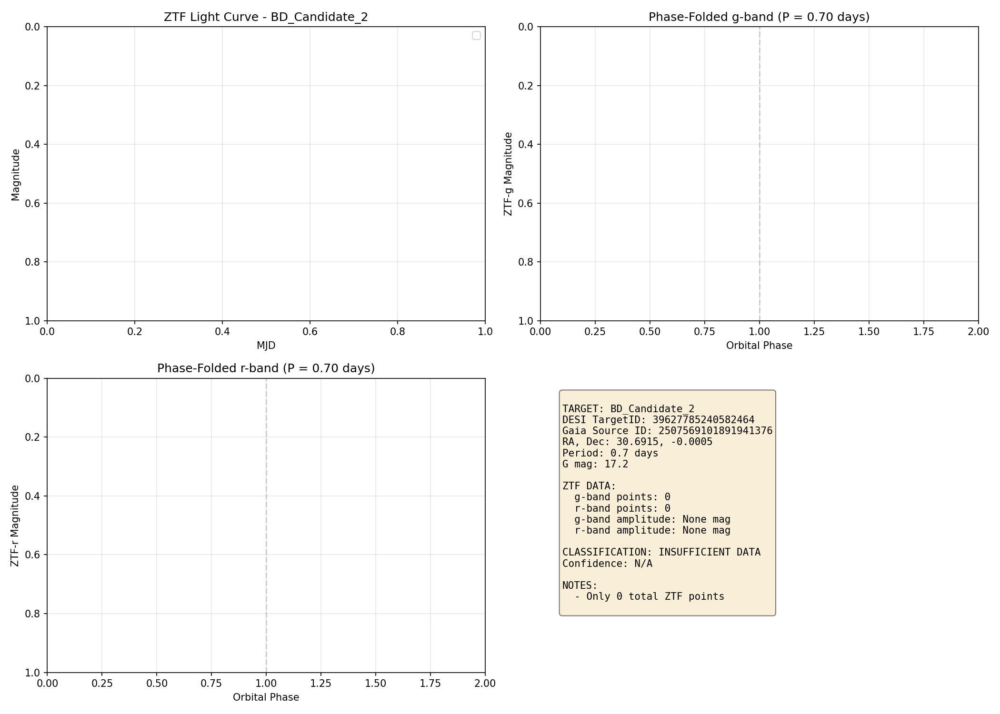
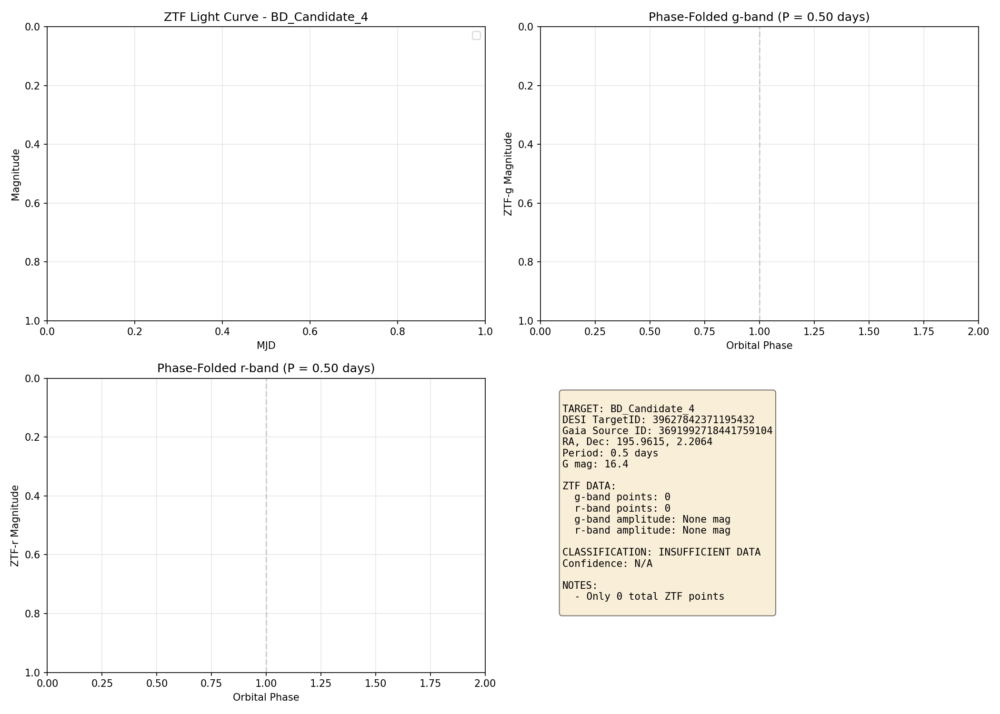

# E4 Brown Dwarf ZTF Validation Report

Generated: 2026-01-15T20:34:18.176894

## Summary Table

| Target | Period | G mag | ZTF Data | Classification | Verdict |
|--------|--------|-------|----------|----------------|---------|
| 39627793289448405 | 0.5d | 16.4 | g:0, r:0 | INSUFFICIENT DATA | **INCONCLUSIVE** |
| 39627785240582464 | 0.7d | 17.2 | g:0, r:0 | INSUFFICIENT DATA | **INCONCLUSIVE** |
| 39627743385616469 | 1.1d | 18.8 | None | NO ZTF DATA | **INCONCLUSIVE** |
| 39627842371195432 | 0.5d | 16.4 | g:0, r:0 | INSUFFICIENT DATA | **INCONCLUSIVE** |

## Detailed Results

### BD_Candidate_1 (39627793289448405)

- **Gaia ID**: 3833554806157884928
- **Coordinates**: RA=150.3709, Dec=0.1833
- **Period**: 0.5 days
- **G magnitude**: 16.4
- **ZTF Data**: Yes

**Classification**: INSUFFICIENT DATA
**Confidence**: N/A

**Notes:**
- Only 0 total ZTF points

---

### BD_Candidate_2 (39627785240582464)

- **Gaia ID**: 2507569101891941376
- **Coordinates**: RA=30.6915, Dec=-0.0005
- **Period**: 0.7 days
- **G magnitude**: 17.2
- **ZTF Data**: Yes

**Classification**: INSUFFICIENT DATA
**Confidence**: N/A

**Notes:**
- Only 0 total ZTF points

---

### BD_Candidate_3 (39627743385616469)

- **Gaia ID**: 3251124869651250304
- **Coordinates**: RA=55.7510, Dec=-1.8526
- **Period**: 1.1 days
- **G magnitude**: 18.8
- **ZTF Data**: No

**Classification**: NO ZTF DATA
**Confidence**: N/A

**Notes:**
- Target not in ZTF footprint or too faint

---

### BD_Candidate_4 (39627842371195432)

- **Gaia ID**: 3691992718441759104
- **Coordinates**: RA=195.9615, Dec=2.2064
- **Period**: 0.5 days
- **G magnitude**: 16.4
- **ZTF Data**: Yes

**Classification**: INSUFFICIENT DATA
**Confidence**: N/A

**Notes:**
- Only 0 total ZTF points

---
