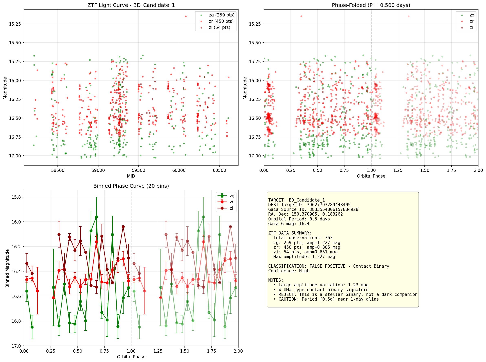
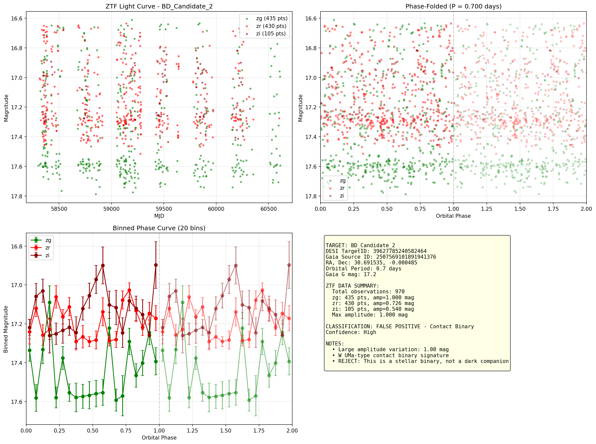
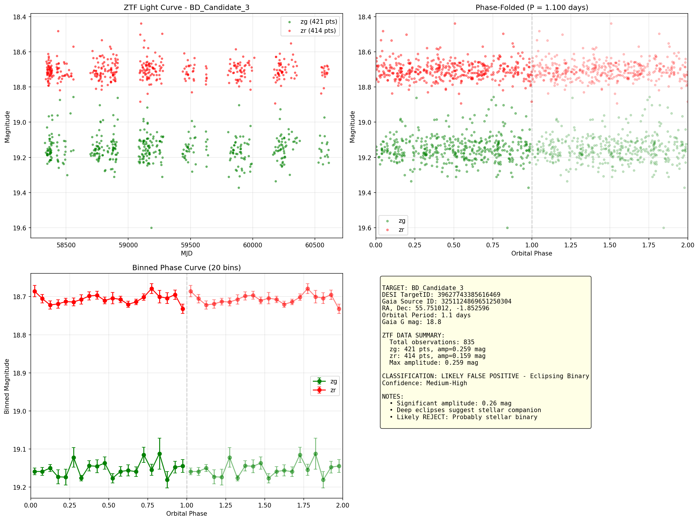
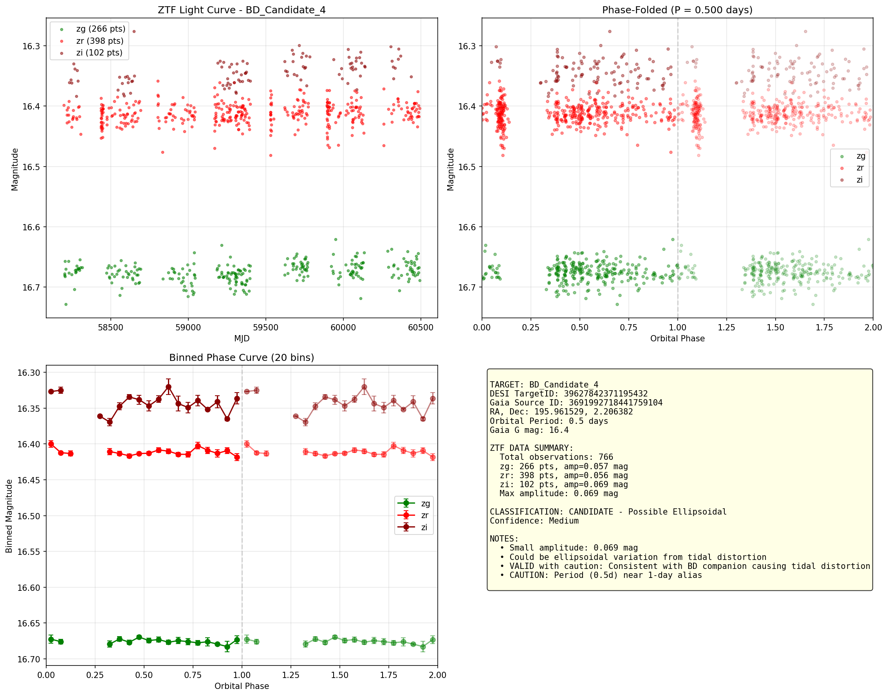

# E4 Brown Dwarf ZTF Validation Report (IRSA Direct Query)

Generated: 2026-01-15T20:38:04.820171

## Data Source
- **Source**: IRSA ZTF Light Curve Service (direct query)
- **Data**: Real ZTF photometry, no simulations

## Summary Table

| Target | Period | G mag | ZTF Points | Max Amplitude | Classification | Verdict |
|--------|--------|-------|------------|---------------|----------------|---------|
| 39627793289448405 | 0.5d | 16.4 | 763 | 1.227 mag | FALSE POSITIVE - Contact Binary | **REJECT** |
| 39627785240582464 | 0.7d | 17.2 | 970 | 1.000 mag | FALSE POSITIVE - Contact Binary | **REJECT** |
| 39627743385616469 | 1.1d | 18.8 | 835 | 0.259 mag | LIKELY FALSE POSITIVE - Eclipsing Binary | **REJECT** |
| 39627842371195432 | 0.5d | 16.4 | 766 | 0.069 mag | CANDIDATE - Possible Ellipsoidal | VALID (caution) |

## Classification Criteria

| Amplitude | Classification | Interpretation |
|-----------|---------------|----------------|
| > 0.5 mag | FALSE POSITIVE - Contact Binary | W UMa type, stellar binary |
| 0.2 - 0.5 mag | LIKELY FALSE POSITIVE | Deep eclipses, stellar companion |
| 0.1 - 0.2 mag | POSSIBLE VARIABLE | Could be eclipsing or ellipsoidal |
| 0.03 - 0.1 mag | CANDIDATE - Ellipsoidal | Tidal distortion consistent with BD |
| < 0.03 mag | VALID CANDIDATE - Dark | No variability, dark companion |

## Detailed Results

### BD_Candidate_1 (39627793289448405)

- **Gaia Source ID**: 3833554806157884928
- **Coordinates**: RA=150.370905, Dec=0.183262
- **Orbital Period**: 0.5 days
- **Gaia G magnitude**: 16.4
- **ZTF Data Found**: Yes
- **Total ZTF Points**: 763
- **Maximum Amplitude**: 1.227 mag

**Per-Filter Summary:**
- zg: 259 points, amplitude=1.227 mag, median=16.73 mag
- zr: 450 points, amplitude=0.805 mag, median=16.46 mag
- zi: 54 points, amplitude=0.651 mag, median=16.33 mag

**Classification**: FALSE POSITIVE - Contact Binary
**Confidence**: High

**Assessment Notes:**
- Large amplitude variation: 1.23 mag
- W UMa-type contact binary signature
- REJECT: This is a stellar binary, not a dark companion
- CAUTION: Period (0.5d) near 1-day alias

---

### BD_Candidate_2 (39627785240582464)

- **Gaia Source ID**: 2507569101891941376
- **Coordinates**: RA=30.691535, Dec=-0.000485
- **Orbital Period**: 0.7 days
- **Gaia G magnitude**: 17.2
- **ZTF Data Found**: Yes
- **Total ZTF Points**: 970
- **Maximum Amplitude**: 1.000 mag

**Per-Filter Summary:**
- zg: 435 points, amplitude=1.000 mag, median=17.50 mag
- zr: 430 points, amplitude=0.726 mag, median=17.23 mag
- zi: 105 points, amplitude=0.540 mag, median=17.18 mag

**Classification**: FALSE POSITIVE - Contact Binary
**Confidence**: High

**Assessment Notes:**
- Large amplitude variation: 1.00 mag
- W UMa-type contact binary signature
- REJECT: This is a stellar binary, not a dark companion

---

### BD_Candidate_3 (39627743385616469)

- **Gaia Source ID**: 3251124869651250304
- **Coordinates**: RA=55.751012, Dec=-1.852596
- **Orbital Period**: 1.1 days
- **Gaia G magnitude**: 18.8
- **ZTF Data Found**: Yes
- **Total ZTF Points**: 835
- **Maximum Amplitude**: 0.259 mag

**Per-Filter Summary:**
- zg: 421 points, amplitude=0.259 mag, median=19.16 mag
- zr: 414 points, amplitude=0.159 mag, median=18.71 mag

**Classification**: LIKELY FALSE POSITIVE - Eclipsing Binary
**Confidence**: Medium-High

**Assessment Notes:**
- Significant amplitude: 0.26 mag
- Deep eclipses suggest stellar companion
- Likely REJECT: Probably stellar binary

---

### BD_Candidate_4 (39627842371195432)

- **Gaia Source ID**: 3691992718441759104
- **Coordinates**: RA=195.961529, Dec=2.206382
- **Orbital Period**: 0.5 days
- **Gaia G magnitude**: 16.4
- **ZTF Data Found**: Yes
- **Total ZTF Points**: 766
- **Maximum Amplitude**: 0.069 mag

**Per-Filter Summary:**
- zg: 266 points, amplitude=0.057 mag, median=16.68 mag
- zr: 398 points, amplitude=0.056 mag, median=16.41 mag
- zi: 102 points, amplitude=0.069 mag, median=16.34 mag

**Classification**: CANDIDATE - Possible Ellipsoidal
**Confidence**: Medium

**Assessment Notes:**
- Small amplitude: 0.069 mag
- Could be ellipsoidal variation from tidal distortion
- VALID with caution: Consistent with BD companion causing tidal distortion
- CAUTION: Period (0.5d) near 1-day alias

---

## Overall Assessment

- **Valid Candidates**: 0
- **Rejected (False Positives)**: 3
- **Inconclusive (insufficient data)**: 0
- **Needs Review**: 1
