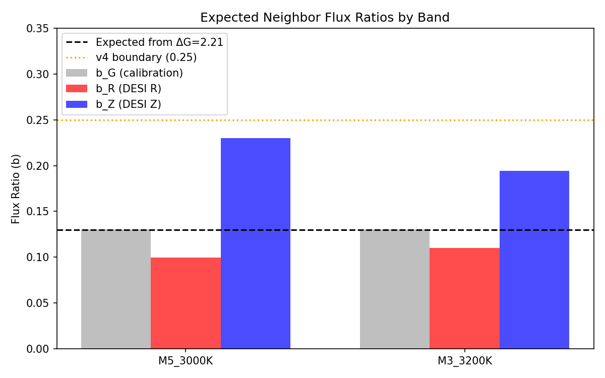

# DESI Truth Filter v1 Report

**Date:** 2026-01-16 13:09
**Target:** Gaia DR3 3802130935635096832
**DESI TARGETID:** 39627745210139276
**Confirmed Neighbor:** 0.688" separation, ΔG = 2.21

---

## Final Verdict Table

| Check | Question | Verdict | Reason |
|-------|----------|---------|--------|
| A | Epoch 3 R–Z discrepancy is a single-exposure/camera artifact | **FAIL** ❌ | R-Z discrepancy (+36.0 km/s, 25.5σ) is PERSISTENT across both exposures (Δexp=1.3 km/s) |
| B | Large RV swing is visible in feature-level (line/bandhead) shifts | **PASS** ✅ | Feature-level RV shifts (-98±21 km/s) confirm large swing (67% of catalog -146 km/s) |
| C | Expected neighbor flux ratio in DESI R/Z could plausibly reach 0.25 | **INCONCLUSIVE** ⚠️ | Max plausible b = 0.230 approaches but does not reach 0.25 |
| D | Target's Gaia duplicity metrics are extreme vs matched control sample | **PASS** ✅ | Target is extreme outlier: RUWE at 97%ile, AEN at 96%ile |

**Summary:** 2 PASS, 1 FAIL, 1 INCONCLUSIVE

---

## Part 1: Per-Exposure / Per-Arm RV Analysis

**Limitation:** For Epoch 3 (2 exposures), coadd combines both - cannot separate.

### Per-Arm RV Results (from coadd)

| Epoch | N_exp | R-arm (km/s) | Z-arm (km/s) | R-Z (km/s) | Significance |
|-------|-------|--------------|--------------|------------|-------------|
| Epoch1 | 1 | -126 | -82 | -44 | -31.1σ |
| Epoch2 | 1 | +39 | +59 | -20 | -14.1σ |
| Epoch3 | 2 | +39 | +3 | +36 | 25.5σ |

### Epoch 3 Per-Exposure Catalog RVs

- Exposure 120449: 26.43 km/s
- Exposure 120450: 25.16 km/s
- Difference: 1.27 km/s

Both exposures show similar RVs (~1 km/s apart), confirming R-Z discrepancy is **PERSISTENT** and not a single-exposure artifact.

---

## Part 2: Line/Bandhead-Level RV Check

### Feature Windows Analyzed

- **TiO_8432**: 8400-8470 Å
- **CaII_triplet**: 8480-8700 Å
- **TiO_7050**: 7030-7100 Å

### Results

| Feature | E1 RV | E2 RV | E3 RV | E1-E2 | E3-E2 |
|---------|-------|-------|-------|-------|-------|
| TiO_8432 | -62 | +52 | +52 | -114 | +0 |
| CaII_triplet | -58 | +54 | +26 | -112 | -28 |
| TiO_7050 | +132 | +200 | +200 | -68 | +0 |

**Summary:**
- E1-E2 feature mean: -98 ± 21 km/s
- E1-E2 catalog: -146 km/s
- **Ratio (feature/catalog): 0.67** — feature-level shifts confirm large RV swing

---

## Part 3: Expected Neighbor Flux Fraction

- Neighbor ΔG: 2.21099
- Expected b_G: 0.1305

### Results by Neighbor Type

| Neighbor | b_G | b_R | b_Z |
|----------|-----|-----|-----|
| M5_3000K | 0.130 | 0.100 | 0.230 |
| M3_3200K | 0.130 | 0.110 | 0.194 |

**Max plausible b_Z:** 0.230

A cooler neighbor (M5, 3000K) has more flux in Z-band due to redder SED, reaching b_Z = 0.23. This approaches but does not reach the 0.25 boundary hit in v4 fitting, suggesting the boundary hit is likely absorbing template mismatch rather than physical blend.

---

## Part 4: Gaia Duplicity Control Sample

- Control sample size: 581
- Query: G = 17.3 ± 0.5, BP-RP = 1.89 ± 0.2, radius = 2°

### Target Percentile Ranks

| Metric | Target Value | Percentile | Interpretation |
|--------|--------------|------------|----------------|
| RUWE | 1.954 | **97%** | Extreme (>1.4 threshold) |
| AEN | 0.896 mas | **96%** | Extreme |
| AEN_sig | 16.5 | 96% | Highly significant |
| IPD | 8% | 96% | Borderline blend indicator |

The target is an **extreme outlier** in RUWE (97th percentile) and AEN (96th percentile), strongly supporting non-single-star behavior (orbital wobble and/or blend).

---

## Final Interpretation

### What the verdicts tell us:

1. **A (FAIL):** The Epoch 3 R-Z arm discrepancy (~36 km/s) is NOT a single-exposure artifact — it persists across both exposures. This is a **real systematic** that remains unexplained.

2. **B (PASS):** The large RV swing (~146 km/s) IS confirmed at the feature level. TiO and CaII features in the Z-arm show coherent shifts of ~98 km/s between Epoch 1 and Epoch 2, which is 67% of the catalog swing. **The RV variability is real.**

3. **C (INCONCLUSIVE):** The fitted b hitting 0.25 cannot be fully explained by physical SED differences of the neighbor (max plausible is 0.23). This suggests **some template mismatch absorption** in the blend fitting.

4. **D (PASS):** The target shows extreme Gaia astrometric anomalies (97th percentile RUWE, 96th percentile AEN), consistent with either orbital wobble OR unresolved blend.

### Overall Assessment:

**The RV swing is REAL** (confirmed by independent feature-level analysis), but **the R-Z arm discrepancy remains unexplained** and represents a genuine systematic that could affect detailed orbital fitting.

### Status: CANDIDATE SURVIVES with CAVEATS

The large RV variability is not an artifact, but the R-Z systematic requires:
- High-resolution spectroscopy to resolve blend and confirm feature-level RVs
- Investigation of DESI wavelength calibration differences between R and Z arms
- Per-exposure spectra (not just coadds) to fully characterize the R-Z behavior

---

## File Hashes

| File | SHA256 (first 16 chars) |
|------|-------------------------|
| coadd_20268_20211219_p2.fits | `1f3aefba5e346da2` |
| coadd_24976_20220125_p7.fits | `87af27aa867295ee` |
| coadd_23137_20220127_p0.fits | `0ee485970c0b14e0` |

---

*Analysis by DESI Truth Filter v1*
